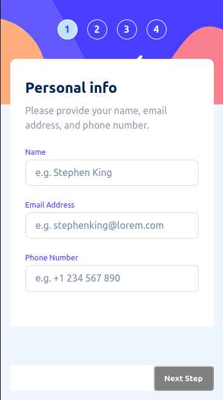

# Frontend Mentor - Multi-step form solution

This is a solution to the [Multi-step form challenge on Frontend Mentor](https://www.frontendmentor.io/challenges/multistep-form-YVAnSdqQBJ). Frontend Mentor challenges help you improve your coding skills by building realistic projects. 

## Table of contents

- [Overview](#overview)
  - [The challenge](#the-challenge)
  - [Screenshot](#screenshot)
  - [Links](#links)
- [My process](#my-process)
  - [Built with](#built-with)
  - [What I learned](#what-i-learned)
  - [Continued development](#continued-development)
- [Author](#author)
- [Acknowledgments](#acknowledgments)

## Overview

### The challenge

Users should be able to:

- Complete each step of the sequence
- See a summary of their selections on the final step and confirm their order
- View the optimal layout for the interface depending on their device's screen size
- See hover and focus states for all interactive elements on the page

### Screenshot

### Links

- [GitHub Repo](https://github.com/hectorgarcia07/FEM-Multi-Step-Form)
- [Live Solution](https://github.com/hectorgarcia07/FEM-Multi-Step-Form)

## My process

### Built with

- Semantic HTML5 markup
- CSS custom properties
- Flexbox
- Mobile-first workflow
- [React](https://reactjs.org/) - JS library
- [Material UI](https://mui.com/) - Used to built and style components
- [Formik](https://mui.com/) - A control component to easily manage input state on forms
- [Yup](https://github.com/jquense/yup) - A schema builder for parsing and validating form content

### What I learned

I learned how to build a multi page form by rendering the form page based on the user's current page count. I also learned how to create my own custom TextField MUI component by diving into the MUI TextField code base and learning how it was built from the ground up.

Validation and input state handling was made easy using Yup and Formik. Yup was used to build validation schema for the form and Formik was used to easily handle state management, validation, and error handling of input components.

### Continued development

I plan to ‘save’ a user's input and have it displayed accordingly when the user refreshes the page. I plan on doing this by using the browsers localstorage API.
I also plan on refactoring some components and add more testing.

## Author

- [Github](https://github.com/hectorgarcia07)
- Frontend Mentor - [@hectorgarcia07](https://www.frontendmentor.io/profile/hectorgarcia07)
- Twitter - [@jdbjfl](https://www.twitter.com/jdbjfl)

## Acknowledgments

Thanks to the FrontEndMentor team for creating this challenge.
